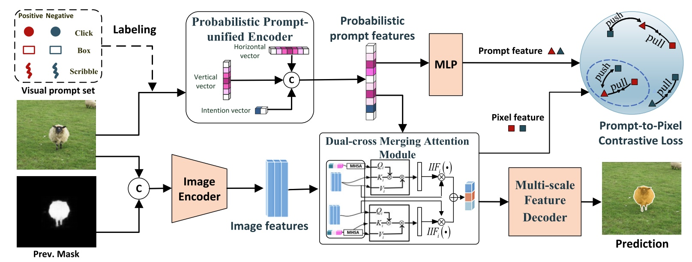
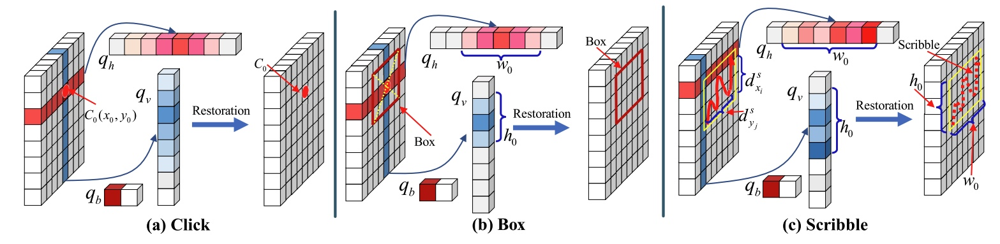

### <p align="center">VPUFormer: Visual Prompt Unified Transformer for Interactive Image Segmentation
<br>
<div align="center">
  <a href="https://www.researchgate.net/profile/Zhang-Xu-48/research" target="_blank">Xu&nbsp;Zhang</a> <b>&middot;</b>
  <a href="https://www.researchgate.net/profile/Kailun-Yang" target="_blank">Kailun&nbsp;Yang</a> <b>&middot;</b>
  Jiacheng&nbsp;Lin</a> <b>&middot;</b>
  Jin&nbsp;Yuan</a> <b>&middot;</b>
  Zhiyong&nbsp;Li</a> <b>&middot;</b>
  Shutao&nbsp;Li</a>
  <br> <br>

  <a href="https://arxiv.org/pdf/2306.06656.pdf" target="_blank">Paper</a>

####

[comment]: <> (  <a href="https://arxiv.org/" target="_blank">Demo Video &#40;Youtube&#41;</a> &emsp;)

[comment]: <> (  <a href="https://arxiv.org/" target="_blank">演示视频 &#40;B站&#41;</a> &emsp;)
</div>
<br>
<p align="center">:hammer_and_wrench: :construction_worker: :rocket:</p>
<p align="center">:fire: We will release code and checkpoints in the future. :fire:</p>
<br>


### Abstract
The integration of diverse visual prompts like clicks, scribbles, and boxes in interactive image segmentation could significantly facilitate user interaction as well as improve interaction efficiency. Most existing studies focus on a single type of visual prompt by simply concatenating prompts and images as input for segmentation prediction, which suffers from low-efficiency prompt representation and weak interaction issues. This paper proposes a simple yet effective Visual Prompt Unified Transformer (VPUFormer), which introduces a concise unified prompt representation with deeper interaction to boost the segmentation performance. Specifically, we design a Prompt-unified Encoder (PuE) by using Gaussian mapping to generate a unified one-dimensional vector for click, box, and scribble prompts, which well captures users' intentions as well as provides a denser representation of user prompts. In addition, we present a Prompt-to-Pixel Contrastive Loss (P$^2$CL) that leverages user feedback to gradually refine candidate semantic features. On this basis, our approach injects prompt representations as queries into Dual-cross Merging Attention (DMA) blocks to perform a deeper interaction between image and query inputs. 


## VPUFormer model



## Probabilistic Prompt-Unified Encoder (PPuE)



## Environment
Training and evaluation environment: Python 3.9, PyTorch 1.13.1, CUDA 11.7. Run the following command to install required packages.
```
pip install -r requirements.txt
```

## Training
Before training, please download the [MAE](https://github.com/facebookresearch/mae) pretrained weights (click to download: [ViT-Base](https://dl.fbaipublicfiles.com/mae/pretrain/mae_pretrain_vit_base.pth), [ViT-Large](https://dl.fbaipublicfiles.com/mae/pretrain/mae_pretrain_vit_large.pth) and [ViT-Huge](https://dl.fbaipublicfiles.com/mae/pretrain/mae_pretrain_vit_huge.pth)).

Use the following code to train a huge model on C+L: 
```
python train.py models/iSegNet/vpu_base448_cocolvis.py \
    --is-model-path=isegm/model/is_vpu_model.py \
    --batch-size=12 \
    --workers=4 \
    --ngpus=1
```

## Evaluation

Use the following code to evaluate the huge model.

```
MODEL_PATH=xxx.pth
python scripts/evaluate_pclmodel.py NoBRS \
    --gpus=1 \
    --checkpoint=${MODEL_PATH} \
    --datasets=GrabCut,Berkeley,DAVIS,PascalVOC,SBD \\
    --iou-analysis \
    --save-ious \
    --print-ious

```


## Model weights 
PVPUFormer models: [Google Drive](https://drive.google.com/drive/folders/1_XaEIJnPkW9fWoZsYZcfWpGyEXuvonUM?usp=drive_linkr)

## Datasets

We train all our models on SBD and COCO+LVIS and evaluate them on GrabCut, Berkeley, DAVIS, SBD and PascalVOC. We also provide links to additional datasets: ADE20k and OpenImages, that are used in ablation study.

| Dataset   |                      Description             |           Download Link              |
|-----------|----------------------------------------------|:------------------------------------:|
|ADE20k     |  22k images with 434k instances (total)      |  [official site][ADE20k]             |
|OpenImages |  944k images with 2.6M instances (total)     |  [official site][OpenImages]         |
|MS COCO    |  118k images with 1.2M instances (train)     |  [official site][MSCOCO]             |
|LVIS v1.0  |  100k images with 1.2M instances (total)     |  [official site][LVIS]               |
|COCO+LVIS* |  99k images with 1.5M instances (train)      |  [original LVIS images][LVIS] + <br> [our combined annotations][COCOLVIS_annotation] |
|SBD        |  8498 images with 20172 instances for (train)<br>2857 images with 6671 instances for (test) |[official site][SBD]|
|Grab Cut   |  50 images with one object each (test)       |  [GrabCut.zip (11 MB)][GrabCut]      |
|Berkeley   |  96 images with 100 instances (test)         |  [Berkeley.zip (7 MB)][Berkeley]     |
|DAVIS      |  345 images with one object each (test)      |  [DAVIS.zip (43 MB)][DAVIS]          |
|Pascal VOC |  1449 images with 3417 instances (validation)|  [official site][PascalVOC]          |
|COCO_MVal  |  800 images with 800 instances (test)        |  [COCO_MVal.zip (127 MB)][COCO_MVal] |
|BraTS      |  369 cases (test)                            |  [BraTS20.zip (4.2 MB)][BraTS]       |
|OAI-ZIB    |  150 cases (test)                            |  [OAI-ZIB.zip (27 MB)][OAI-ZIB]      |

[ADE20k]: http://sceneparsing.csail.mit.edu/
[OpenImages]: https://storage.googleapis.com/openimages/web/download.html
[MSCOCO]: https://cocodataset.org/#download
[LVIS]: https://www.lvisdataset.org/dataset
[SBD]: http://home.bharathh.info/pubs/codes/SBD/download.html
[GrabCut]: https://drive.google.com/uc?export=download&id=1qKorUonIQcn3Z_IB6-en1K5q1K4T6pVK
[Berkeley]: https://drive.google.com/uc?export=download&id=1yo6PMKaMAu5jCCWf-Qf2boeG18b-m4vZ
[DAVIS]: https://drive.google.com/uc?export=download&id=1kyjN6EJSjwGnzSJxVjm3Pl2-XAjV7tac
[PascalVOC]: http://host.robots.ox.ac.uk/pascal/VOC/
[COCOLVIS_annotation]: https://drive.google.com/uc?export=download&id=17z9aZPlRv8vpU1AEz_M0WuZC6uBkqEWE
[COCO_MVal]: https://drive.google.com/uc?export=download&id=1_TgkjAmmpJLMIYSBRp89gaPNrFp_XxW5
[BraTS]: https://drive.google.com/uc?export=download&id=1uaveX_nziTLaJOj-Gl3csvIaa6Q__EhP
[OAI-ZIB]: https://drive.google.com/uc?export=download&id=11N6pJL5HowogUriCXVFbK3GacPL2X2Xx


(*) To prepare COCO+LVIS, you need to download original LVIS v1.0, then download and unpack our 
pre-processed annotations that are obtained by combining COCO and LVIS dataset into the folder with LVIS v1.0.


## Citation

```
@article{zhang2024pvpuformer,
  title={PVPUFormer: Probabilistic Visual Prompt Unified Transformer for Interactive Image Segmentation},
  author={Zhang, Xu and Yang, Kailun and Lin, Jiacheng and Yuan, Jin and Li, Zhiyong and Li, Shutao},
  journal={IEEE Transactions on Image Processing},
  year={2024},
  publisher={IEEE}
}
```

## Acknowledgement
Our project is developed based on [RITM](https://github.com/SamsungLabs/ritm_interactive_segmentation), [SimpleClick](https://github.com/uncbiag/SimpleClick) and [CFR-ICL](https://github.com/TitorX/CFR-ICL-Interactive-Segmentation)
