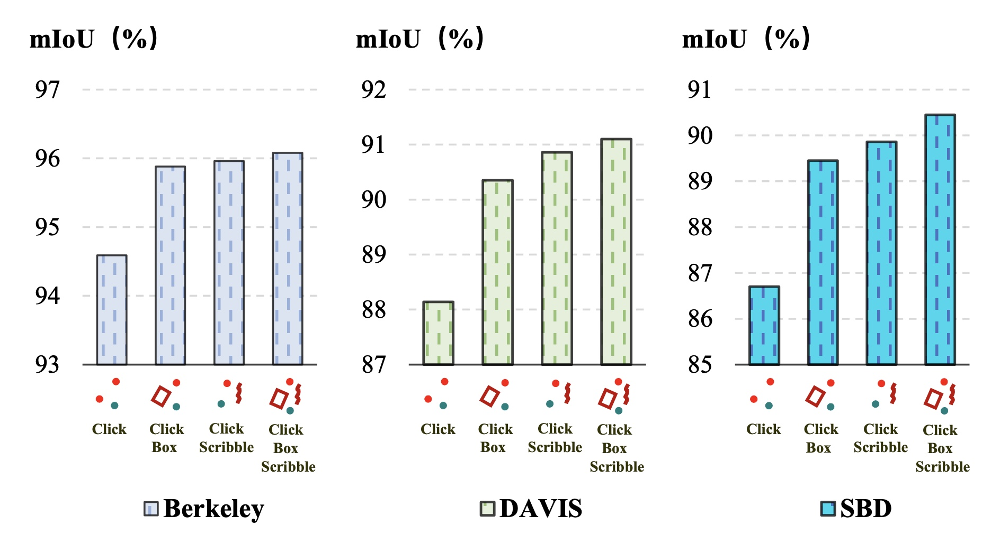
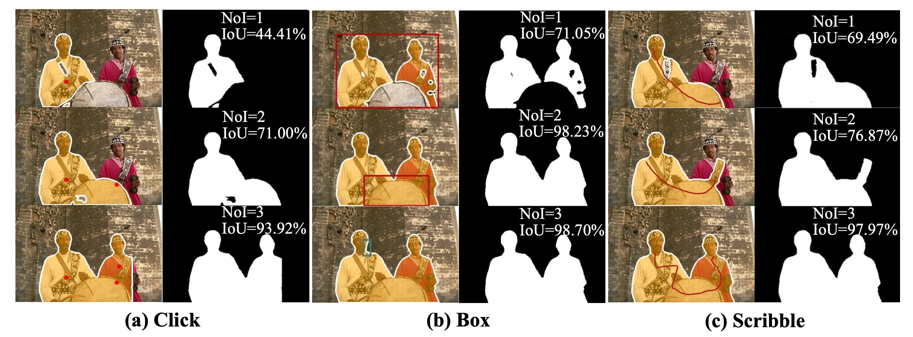

### 
VPUFormer: Visual Prompt Unified Transformer for Interactive Image Segmentation
 

  <a href="https://www.researchgate.net/profile/Zhang-Xu-48/research" target="_blank">Xu&nbsp;Zhang</a> <b>&middot;</b>
  <a href="https://www.researchgate.net/profile/Kailun-Yang" target="_blank">Kailun&nbsp;Yang</a> <b>&middot;</b>
  Jiacheng&nbsp;Lin</a> <b>&middot;</b>
  Jin&nbsp;Yuan</a> <b>&middot;</b>
  Zhiyong&nbsp;Li</a> <b>&middot;</b>
  Shutao&nbsp;Li</a>
     

  <a href="https://arxiv.org/pdf/2306.06656.pdf" target="_blank">Paper</a>

####

[comment]: <> (  <a href="https://arxiv.org/" target="_blank">Demo Video &#40;Youtube&#41;</a> &emsp;)

[comment]: <> (  <a href="https://arxiv.org/" target="_blank">演示视频 &#40;B站&#41;</a> &emsp;)

 

:hammer_and_wrench: :construction_worker: :rocket:

:fire: We will release code and checkpoints in the future. :fire:

 

### Update
- 2023.06.08 Init repository.
- 2023.06.11 Release the [arXiv](https://arxiv.org/abs/2306.06656) version.

### TODO List
- [ ] Code release. 

### Abstract
The integration of diverse visual prompts like clicks, scribbles, and boxes in interactive image segmentation could significantly facilitate user interaction as well as improve interaction efficiency. Most existing studies focus on a single type of visual prompt by simply concatenating prompts and images as input for segmentation prediction, which suffers from low-efficiency prompt representation and weak interaction issues. This paper proposes a simple yet effective Visual Prompt Unified Transformer (VPUFormer), which introduces a concise unified prompt representation with deeper interaction to boost the segmentation performance. Specifically, we design a Prompt-unified Encoder (PuE) by using Gaussian mapping to generate a unified one-dimensional vector for click, box, and scribble prompts, which well captures users' intentions as well as provides a denser representation of user prompts. In addition, we present a Prompt-to-Pixel Contrastive Loss (P$^2$CL) that leverages user feedback to gradually refine candidate semantic features. On this basis, our approach injects prompt representations as queries into Dual-cross Merging Attention (DMA) blocks to perform a deeper interaction between image and query inputs. 

## VPUFormer model

## Results

### Contact
Feel free to contact me if you have additional questions or have interests in collaboration. Please drop me an email at xuzhang1211@hnu.edu.cn. =)
